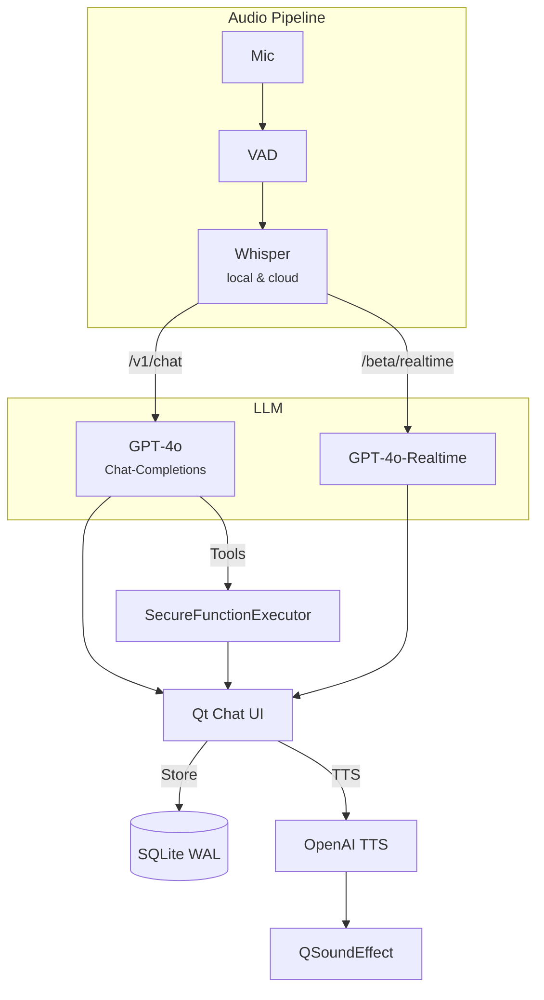

# HandycapAI

> **macOS voice‑first assistant for hands‑free productivity**
> Powered by Whisper (local or cloud) • GPT‑4o Chat‑Completions & Realtime • Custom Python tools • Secure local storage • Py2app‑bundled & notarised


---

## Table of Contents

1. [Key Features](#key-features)
2. [Architecture](#architecture)
3. [Quick Start](#quick-start)
4. [Every‑day Usage](#every-day-usage)
5. [Settings Reference](#settings-reference)
6. [Building a Stand‑alone .app](#building-a-stand-alone-app)
7. [Security Model](#security-model)
8. [Troubleshooting & FAQ](#troubleshooting--faq)
9. [Contributing](#contributing)
10. [Roadmap](#roadmap)
11. [Credits & License](#credits--license)

---

## Key Features

| Category              | Highlights                                                                                                                                                                                        |       |        |       |       |                                             |
| --------------------- | ------------------------------------------------------------------------------------------------------------------------------------------------------------------------------------------------- | ----- | ------ | ----- | ----- | ------------------------------------------- |
| **Voice Input**       | • Porcupine wake‑word "Hello Freya" or global hot‑key<br>• Single‑shot *and* extended listening ("keep listening / stop listening")<br>• Real‑time VAD + low‑latency 24 kHz capture               |       |        |       |       |                                             |
| **Speech‑to‑Text**    | • Local Whisper **medium** with Apple Silicon acceleration<br>• Automatic cloud fallback to `whisper-1` when GPU unavailable                                                                      |       |        |       |       |                                             |
| **LLM Back‑end**      | • Chat‑Completions streaming (`/v1/chat/completions`)<br>• Realtime API (`/beta/realtime`) – basic (text‑only) & advanced (text + audio + function‑calling) modes                                 |       |        |       |       |                                             |
| **Custom Tools**      | • Define Python functions in Settings (name / description / JSON schema / code)<br>• SecureFunctionExecutor validates AST, sandboxes built‑ins, optional subprocess isolation                     |       |        |       |       |                                             |
| **TTS**               | • OpenAI `/v1/audio/speech` (models: alloy                                                                                                                                                        | echo  | fable  | onyx  | nova  | shimmer)<br>• Adjustable per‑message volume |
| **macOS Integration** | • Menu‑bar tray icon with live state (idle / listening / processing)<br>• AppleScript text insertion, system metrics, screenshot helper<br>• `py2app` recipe + notarisation script (staple‑ready) |       |        |       |       |                                             |
| **Persistence**       | • SQLite WAL‑mode, auto‑repair on corruption<br>• Encrypted API key with Fernet (per‑user key‑file in `~/Library/Application Support/HandycapAI/`)                                                |       |        |       |       |                                             |
| **Accessibility**     | • One‑hand‑friendly hot‑keys (⇧⌘␣ by default)<br>• Fully voice controllable, no hidden UI flows                                                                                                   |       |        |       |       |                                             |

---

## Architecture



*The entire event‑loop is bound to Qt via **qasync**, allowing seamless `asyncio` coroutines inside PySide6 widgets.*

---

## Quick Start

### 1. Prerequisites

| Component     | Version / Notes                                                                     |
| ------------- | ----------------------------------------------------------------------------------- |
| **macOS**     | 10.15 (Catalina) or newer – Intel & Apple Silicon verified                          |
| **Python**    | 3.11 / 3.12 (use `pyenv` or Homebrew)                                               |
| **Homebrew**  | For PortAudio & optional dev tools                                                  |
| **API Keys**  | • **OpenAI** (chat / tts / whisper‑1)<br>• **Picovoice** (Porcupine) – free tier OK |
| **PortAudio** | `brew install portaudio` *only needed if PyAudio wheel missing*                     |

### 2. Clone & Set‑up

```bash
# 1. Get the code
$ git clone https://github.com/yourname/handycapai.git
$ cd handycapai

# 2. Create a virtual‑env
$ python3 -m venv .venv
$ source .venv/bin/activate

# 3. Install accelerated PyTorch first (Apple Silicon)
$ pip install torch==2.2.2 --index-url https://download.pytorch.org/whl

# 4. Install all other deps
$ pip install -r requirements.txt
```

### 3. First Run

```bash
$ python main.py
```

1. A grey mic appears in your menu‑bar.
2. **Right‑click → Settings**: paste your OpenAI key, optionally Picovoice key.
3. Enable *Wake‑word*.
4. Close Settings – say "Hello Freya" – mic turns cyan, start chime plays.
5. Speak, and voilà: your first hands‑free chat!

> **Tip – Local Whisper**: The first transcription warms up the model. Expect a 5‑second compile on Apple Silicon, then lightning‑fast.

---

## Every‑day Usage

### System Tray

| State      | Icon                               | Meaning                         |
| ---------- | ---------------------------------- | ------------------------------- |
| idle       |         | Waiting for wake‑word / hot‑key |
| listening  |         | Recording – VAD active          |
| processing |  | Transcribing or talking to GPT  |

### Hot‑Keys *(defaults – customise in Settings)*

| Action                   | Shortcut |
| ------------------------ | -------- |
| Start single‑shot listen | ⇧⌘␣      |
| Cancel / stop            | Esc      |
| Open Chats window        | ⇧⌘C      |

### LLM Modes

| Mode                                | Best For                | Latency  | Extras                                        |
| ----------------------------------- | ----------------------- | -------- | --------------------------------------------- |
| **Stream** (`/v1/chat/completions`) | Long answers, tools     | \~500 ms | Supports function‑calling                     |
| **Realtime Basic**                  | Fast text‑only replies  | \~250 ms | Minimal bandwidth                             |
| **Realtime Advanced**               | Conversational voice UX | \~200 ms | Voice output, live partials, function‑calling |

Switch on‑the‑fly via the **Quick Settings Bar** in every Chats window.

### Text‑to‑Speech

1. Enable *TTS* in Settings.
2. Pick a voice (alloy, echo, …) & volume.
3. Assistant replies auto‑speak; cancel by starting a new voice input.

### Custom Functions

1. Open **Settings → Custom Functions**.
2. Click **Add** – fill **Name**, **Description**, **Python Action**, optional `parameters` JSON schema.
3. Save – GPT can now call `name` with structured arguments.

Example *paste note* function:

```python
# Action field – executed in sandbox
automation.insert_text(args.get('text', ''))
result = 'Note pasted!'
```

Say *"Freya, save the note: Buy oat milk"* → HandycapAI inserts the sentence at your cursor.

---

## Settings Reference

| Key                   | Default     | Description                                                                        |                      |
| --------------------- | ----------- | ---------------------------------------------------------------------------------- | -------------------- |
| `api_mode`            | "stream"    | "stream" or "realtime"                                                             |                      |
| `realtime_basic_mode` | `true`      | When `api_mode = realtime`, choose Basic (true) or Advanced (false) implementation |                      |
| `openai_api_key`      | *encrypted* | Stored via Fernet; empty means "not set"                                           |                      |
| `tts_enabled`         | `false`     | Toggle OpenAI TTS playback                                                         |                      |
| `tts_voice`           | "alloy"     | One of alloy / echo / fable / onyx / nova / shimmer                                |                      |
| `tts_volume`          | `1.0`       | 0.0 – 1.0                                                                          |                      |
| `wake_word_enabled`   | `false`     | Enable Porcupine listener                                                          |                      |
| `porcupine_api_key`   | ""          | Format: `ACCESS_KEY` *or* \`ACCESS\_KEY                                            | wake\_words/my.ppn\` |
| `stt_source`          | "local"     | "local" → faster‑whisper; automatically flips to "cloud" on OOM                    |                      |
| `max_context_length`  | `10`        | Messages to send as chat history                                                   |                      |

Settings persist in `~/Library/Preferences/com.handycapai.app.plist`.  Secrets are encrypted with a per‑machine key in `~/Library/Application Support/HandycapAI/settings.key`.

---

## Building a Stand‑alone .app

### 1. Bundle via py2app

```bash
$ source .venv/bin/activate
$ python packaging/setup.py py2app
$ open dist/HandycapAI.app  # test‑run
```

### 2. Notarise (Apple Silicon & Intel)

```bash
# Export once per shell session
$ export AC_PASSWORD="@keychain:MyNotarizePwd"
$ ./packaging/notarize.sh
# Wait for email ≈ 2 min, then staple:
$ xcrun stapler staple dist/HandycapAI.app
```

### 3. Create .dmg *(optional)*

```bash
$ hdiutil create -volname HandycapAI \
            -srcfolder dist/HandycapAI.app \
            -ov -format UDZO HandycapAI.dmg
```

HandycapAI is now ready to distribute via AirDrop, email, or your website.

---

## Security Model

* **No server‑side components** – everything runs on your Mac.<br>
* **Encrypted API Key** – AES‑128‑GCM via `cryptography.Fernet`, unique per user.<br>
* **Function Sandbox** – only whitelisted imports, safe built‑ins, and optional subprocess isolation.<br>
* **Mic Privacy** – audio leaves the machine *only* when `stt_source = cloud`.

---

## Troubleshooting & FAQ

| Symptom                    | Fix                                                                                                                      |
| -------------------------- | ------------------------------------------------------------------------------------------------------------------------ |
| "Wake‑word not detected"   | Verify `porcupine_api_key` – must include AccessKey; ensure mic permissions in `System Settings → Privacy → Microphone`. |
| `pyaudio` fails to install | `brew install portaudio` then `pip install pyaudio==0.2.14`.                                                             |
| Local Whisper OOM          | Set `stt_source = cloud` or switch model size (`faster-whisper small`).                                                  |
| "LLM stream failed" pop‑up | Check Internet; confirm OpenAI key valid; transient 429/502 → try again.                                                 |
| DB corruption dialog       | HandycapAI auto‑renames the damaged file & recreates a fresh DB; your chats may restore via `.corrupt-*` recovery.       |

---

## Contributing

1. Fork → feature branch → PR.
2. `pre-commit install` – enforces `ruff` & `black`.
3. Follow the [Conventional Commits](https://www.conventionalcommits.org/) spec for commit messages.

### Dev Scripts

* `make dev` – run HandycapAI from source with live‑reload.
* `make test` – tox matrix (3.11, 3.12).

---

## Roadmap

* [ ] Voice dictation mode (continuous text insertion)
* [ ] Overdub voice cloning for personalised TTS
* [ ] On‑device GPT‑4o fallback (when feasible)
* [ ] Auto‑update framework (Sparkle‑style)

---

## Credits & License

HandycapAI is © 2025 Ricardo Kupper & contributors.
Code licensed under the **MIT License** (see `LICENSE`).
Wake‑word detection by [Picovoice Porcupine](https://github.com/Picovoice/porcupine) (Apache‑2.0).
Icons by *\[your‑name]*, UI inspired by Apple Messages.

*Made with ❤️ in Zürich – get well soon, left shoulder!*
